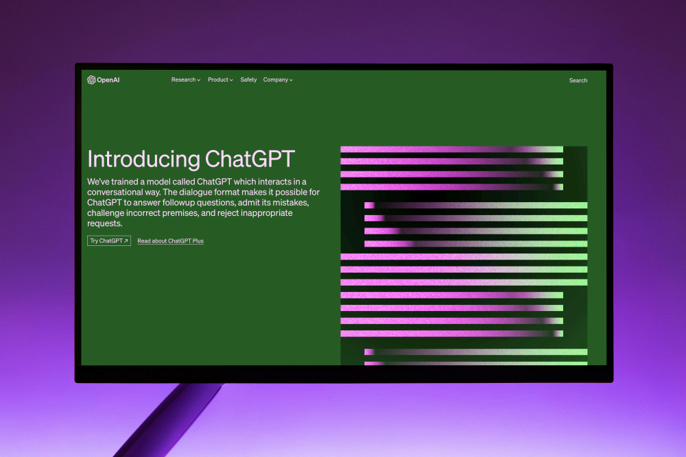
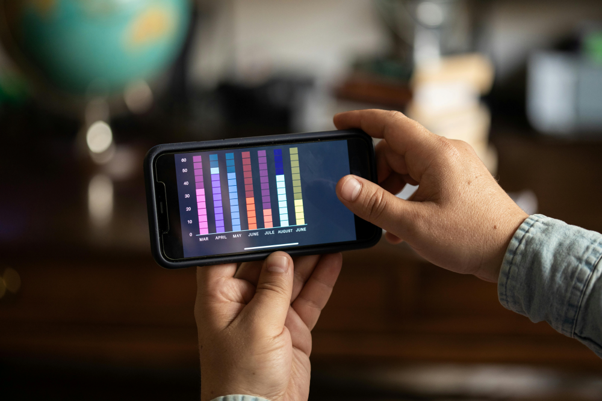

 <!DOCTYPE html>
<html lang="en">
<head>
    <meta charset="UTF-8">
    <meta name="viewport" content="width=device-width, initial-scale=1.0">
    <title>Personal Portfolio Website</title>
    <link rel="stylesheet" href="style.css">
   
    
</head>
<body>

    

        <nav>
            
            <ul id="sidemenu">
                <li><a href="#header">Home</a></li>
                <li><a href="#about">About</a></li>
                <li><a href="#services">Services</a></li>
                <li><a href="#portfolio">Portfolio</a></li>
                <li><a href="#contact">Contact</a></li>
                <i class="fa-solid fa-xmark" onclick="closemenu()"></i>
            </ul> 
            <i class="fa-solid fa-bars"onclick="openmenu()"></i>
               
        </nav>
        
 
           
        

        

           
            <h2 style="text-align: center;"> RIFANA PA </h2>
          
           
            
Front-end Developer | UI/UX Designer

        

    

    <!-- ----------about---------- -->
    

        

            

                

                    
                

                

                    <h1 style="font-family: Cambria, Cochin, Georgia, Times, 'Times New Roman', serif;" class="sub-title">ABOUT ME</h1> 
                    
Hello! I'm Rifana PA, a passionate front-end developer and UI/UX designer dedicated to crafting exceptional digital experiences. With more than 5 years of experience in the industry, I've developed a strong foundation in HTML, CSS, JavaScript, and React. My design philosophy is centered around user-centered design, simplicity, and innovative problem-solving. When I'm not coding or designing, you can find me dealing with paintings. Let's connect and create something amazing together!

                    
                    

                        
SKILLS
 
                        
EXPERIENCE
 
                        
EDUCATION
 

                    

                    

                        <ul>
                            <li>
                                UI/UX Designing Web/App interfaces
                            </li> 
                            <li>
                                Web Development Web App Development
                            </li> 
                            <li>
                                App Development Building Android/iOS Apps
                            </li> 
                            <li>
                                Front-end developer Building Front-end of Web/Applications
                            </li>
                        </ul>
                    

                    

                        <ul>
                            <li>
                                2025 - Current UI/UX Design Trainer and Front-end Developer at ET Institute
                            </li> 
                            <li>
                                2023 - 2025 Team lead at Startup LLC.
                            </li> 
                            <li>
                                2021 - 2023 UI/UX Design Executive at Coin Digital Ltd.
                            </li> 
                            <li>
                                2020 - 2021 Internship at Varcons Technology Private Ltd.
                            </li>
                        </ul>
                    

                    

                        <ul>
                            <li>
                                2020 UI/UX Design Training at EET Institute Bangalore.
                            </li> 
                            <li>
                                2019 Front-end Training at EET Institute Bangalore.
                            </li> 
                            <li>
                                2018 BE from HMSIT Tumkur.
                            </li> 
                           
                        </ul>
                    

                

            

        

    

<!-- ------services----- -->
 

    

        <h1 class="sub-title">MY SERVICES</h1> 
        

            

                <i class="fa-sharp fa-solid fa-code"></i> 
               
                <h2>Web Design</h2> 
                

                 Custom Website Design: Creating a unique and tailored website design that reflects the client's brand and vision. 
                 Responsive Web Design: Designing websites that are optimized for various devices, including desktops, laptops, tablets, and smartphones. 
                 Website Redesign: Updating and refreshing an existing website's design to improve its appearance, usability, and performance. 
                 Landing Page Design: Creating dedicated landing pages that are optimized for conversions, such as sales, sign-ups, or downloads. 
                    
                
 
                <a href="#">Learn more</a>
            

            

                <i class="fa-solid fa-crop-simple"></i> 
                <h2>UI/UX Design</h2> 
                

 User Research: Conducting research to understand the target audience's needs, behaviors, and motivations. 
 Wireframing: Creating low-fidelity sketches of the website's layout and functionality. 
  Visual Design: Creating the visual design of the application, including the color scheme, typography, and imagery. 
 Icon Design: Designing custom icons that are used throughout the application. 
Button Design: Designing custom buttons that are used throughout the application. 
Layout Design: Designing the layout of the application, including the positioning of elements and the use of whitespace. 
 
                
 
                <a href="#">Learn more</a>
            

            

                <i class="fab fa-app-store"></i> 
                <h2>App Design</h2> 
                

                     iOS App Design: Designing intuitive and user-friendly interfaces for iOS apps. 
                     Android App Design: Designing intuitive and user-friendly interfaces for Android apps. 
                     Cross-Platform App Design: Designing apps that work seamlessly across multiple platforms, including iOS, Android, and Windows. 
                     Mobile App Prototyping: Creating interactive prototypes to test and refine the app's design and functionality. 
                
 
                <a href="#">Learn more</a>
            

            

                <i class="fa-solid fa-server"></i> 
                <h2>Front-end Development</h2> 
                

                     HTML/CSS Development: Writing clean, semantic HTML and CSS code to bring the design to life. 
                     JavaScript Development: Adding interactivity to the website using JavaScript libraries and frameworks. 
                     Responsive Development: Ensuring the website is optimized for various devices and screen sizes. 
                     Accessibility Development: Ensuring the website meets accessibility standards and is usable by everyone. 
                
 
                <a href="#">Learn more</a>
            

        

    

 

 <!-- -------portfolio---- -->
  

    

        
        <h1 class="sub-title">MY WORK</h1>   
        

            

                
                

                    <h3>Social Media Application</h3>
                    
The app connects you to the talented people around the world.
                        Download it from play store.
                    

                    <a href="#"><i class="fa-solid fa-arrow-up-right-from-square"></i></a>
                

            

            

                
                

                    <h3>Website Design</h3>
                    
This website is used to generate text with the help of AI.
                        Login to this website using google chrome.
                    

                    <a href="#"><i class="fa-solid fa-arrow-up-right-from-square"></i></a>
                

            

            

                
                

                    <h3>Music Application</h3>
                    
This application contains music from world wide.
                        Download it from play store.
                    

                    <a href="#"><i class="fa-solid fa-arrow-up-right-from-square"></i></a>
                

            

            

                
                

                    <h3>Stock Market Application</h3>
                    
The application is used to invest in stock market.
                        Download it from play store.
                    

                    <a href="#"><i class="fa-solid fa-arrow-up-right-from-square"></i></a>
                

            

            

            

            
        

        <a href="#" class="btn">See more</a>

    

  

  <!-- -----contact------ -->
   

    

        

            

                <h1 class="sub-title">Contact Me</h1>
                
<i class="fa-solid fa-paper-plane"></i>
                    rifanapa2001@gmail.com
                

                
<i class="fa-solid fa-phone"></i>8073927783

                

                    <a href="https://facebook.com/"><i class="fa-brands fa-facebook"></i></a>
                    <a href=""><i class="fa-brands fa-x-twitter"></i></a>
                    <a href=""><i class="fa-brands fa-instagram"></i></a>
                    <a href=""><i class="fa-brands fa-linkedin"></i></a>
                

                <a href="my-cv.pdf" download class="btn btn2">Download CV</a>
            

           
            

                <form name="submit-to-google-sheet">
                    <input type="text" name="Name" placeholder="Your Name" required>
                    <input type="email" name="Email" placeholder="Your Email " required>
                    <textarea name="Message" rows="6" placeholder="Your Message"></textarea>
                    <button type="submit" class="btn btn2">Submit</button>
                </form>
                
            

        

       
    

    

        
Copyright @ Riff.Built with ..<i class="fa-solid fa-palette"></i> passion and creativity.

    

   

    

 
 
</body>
</html>

*{
    margin: 0;
    padding: 0;
    font-family: 'Poppins', sans-serif;
    box-sizing: border-box;

}
html{
    scroll-behavior: smooth;
}
body{
    background: #080808 ;

color: #fff;
}
#header{
    width: 100;
    height: 100vh;
    background-image: url(background.png);
    background-size: cover;
    background-position: right;
}
.container{
    padding: 10px 10%;

}

nav{
    display: flex;
    align-items: right;
    justify-content: space-between;
    flex-wrap: wrap;
}

.logo-6{
    width: 60px;
    

}

nav ul li{
    display: inline-block;
    list-style: none;
    margin:10px 10px;
}
nav ul li a{
    color: #fff;
    text-decoration: none;
    font-size: 18px;
    position: relative;
  
}
nav ul li a::after{
    content: '';
    width: 0;
    height: 3px;
    background: #ff004f;
    position: absolute;
    left: 10px;
    bottom: -6px;
    transition: 0.5s;
}
nav ul li a:hover::after{
    width: 50%;
}
.header-text{
   margin-top: 1px;
    font-size: 17px;
   font-family: 'Franklin Gothic Medium', 'Arial Narrow', Arial, sans-serif;
}

.header-text h2{
    font-size: 50px;
   margin-top: 1px;
    font-weight: 300;
  font-family: Georgia, 'Times New Roman', Times, serif;
    
    
}
.header-text h2 span{
    color:hsla(0, 58%, 44%, 0.887);
    font-family: Georgia, 'Times New Roman', Times, serif;
}
/* ---------about------- */

#about{
    padding: 80px 0;
    color: #ababab;
}
.row{
    display: flex;
    justify-content: space-between;
    flex-wrap: wrap;

}
.about-col-1{
    flex-basis: 60%;

}
.about-col-1 img{
    width: 100%;
    border-radius: 15px;
    
}
.about-col-2{
    flex-basis: 35%;
}
.sub-title{
    font-size: 60px;
    font-weight: 600;
    color: #fff;
}
.tab-titles{
    display: flex;
    margin: 20px 0 40px;
}
.tab-links{
    margin-right: 50px;
    font-size: 18px;
    font-weight: 500;
    cursor: pointer;
    position: relative;
}
.tab-links::after{
    content: '';
    width: 0;
    height: 3px;
    background: #ff004f;
    position: absolute;
    left: 0;
    bottom: -8px;
    transition: 0.5s;
}
.tab-links.active-link::after{
    width: 50%;
}
.tab-contents ul li{
    list-style: none;
    margin: 10px 0;

}
.tab-contents ul li span{
    color: #b54769;
    font-size: 14px;
}
.tab-contents{
    display: none;
}
.tab-contents.active-tab{
    display: block;
}
/* -----------services------ */
#services{
    padding: 30px 0;

}
.services-list{
    display: grid;
    grid-template-columns: repeat(auto-fit, minmax(250px, 1fr));
    grid-gap: 40px;
    margin-top: 50px;
}
.services-list div{
    background: #262626;
    padding: 40px;
    font-size: 13px;
    font-weight: 300;
    border-radius: 10px;
    position: relative;
    transition: background 0.5s, transform 0.5s;
}
.services-list div i{
    font-size: 50px;
    margin-bottom: 30px;
}
.services-list div h2{
    font-size: 30px;
    font-weight: 500;
    margin-bottom: 15px;

}
.services-list div a{
    text-decoration: none;
    color: #fff;
    font-size: 12px;
    margin-top: 20px;
    display: inline-block;
}
.services-list div:hover{
    background: #ff004f;
    transform: translateY(-10px);
}
/* ----portfolio--- */
#portfolio{
    padding: 50px 0;

}
.work-list{
    display: grid;
    grid-template-columns: repeat(auto-fit, minmax(250px, 1fr));
    grid-gap: 40px;
    margin-top: 50px;
}
.work{
    border-radius: 10px;
    position: relative;
    overflow: hidden;
}
.work img{
    width: 100%;
    border-radius: 10px;
    display: block;
    transition: transform 0.5s;
}
.layer{
    width: 100%;
    height: 0%;
    background: linear-gradient(rgba(0,0,0,0.6), #ff004f);
    border-radius: 10px;
    position: absolute;
    left: 0;
    bottom: 0;
    overflow: hidden;
    display: flex;
    align-items: center;
    justify-content: center;
    flex-direction: column;
    padding: 0 40px;
    text-align: center;
    font-size: 14px;
    transition: height 0.5s;

}
.layer h3{
    font-weight: 500;
    margin-bottom: 20px;

}
.layer a{
    margin-top: 20px;
    color: #ff004f;
    text-decoration: none;
    font-size: 18px;
    line-height: 60px;
    background: #fff;
    width: 60px;
    height: 60px;
    border-radius: 50%;
    text-align: center;
}
.work:hover img{
    transform: scale(1.1);
}
.work:hover .layer{
    height: 100%;
}
.btn{
    display: block;
    margin: 50px auto;
    width: fit-content;
    border: 1px solid #ff004f;
    padding: 14px 50px;
    border-radius: 6px;
    text-decoration: none;
    color: #fff;
    transition: background 0.5s;
}
.btn:hover{
    background: #ff004f;

}
/* --------contact------ */
.contact-left{
    flex-basis: 35%;
}
    .contact-right{
        flex-basis: 60%;

}
.contact-left p{
    margin-top: 30px;
}
.contact-left p i{
    color: #ff004f;
    margin-right: 15px;
    font-size: 25px;
}
.social-icons{
    margin-top: 30px;

}
.social-icons a{
    text-decoration: none;
    font-size: 30px;
    margin-right: 15px;
    color: #ababab;
    display: inline-block;
    transition: transform 0.5s;
}
.social-icons a:hover{
    color: #ff004f;
    transform: translateY(-5px);
}
.btn.btn2{
    display: inline-flex;
    background: #ff004f;
}
.contact-right form{
    width: 100%;

}
form input, form textarea{
    width: 100%;
    border: 0;
    outline: none;
    background: #262626;
    padding: 15px;
    margin: 15px 0;
    color: #fff;
    font-size: 18px;
    border-radius: 6px;

}
form .btn2{
    padding: 14px 60px;
    font-size: 18px;
    margin-top: 20px;
    cursor: pointer;

}
.copyright{
    width: 100%;
    text-align: center;
    padding: 25px 0;
    background: #262626;
    font-weight: 300;
    margin-top: 20px;

}
.copyright i{
    color: gold;

}
/* -------css for small screen---- */

nav .fa-solid{
    display: none;
}
@media only screen and (max-width: 600px){
    #header{
        background-image: url(background-mobile.png);
        background-position: center;
       
    }
    .header-text{
        margin-top: 50%;
        font-size: 16p;
    }
    .header-text h2{
        font-size: 30px;
    }
    nav .fa-solid{
        display: block;
        
        font-size: 25px;
    }
    nav ul{
        background: #ff004f;
        position: fixed;
        top: 0;
        right: -200px;
        width: 200px;
        height: 100vh;
        padding-top: 50px;
        z-index: 2;
        transition: right 0.5s;
    }
    nav ul li{
        display: block;
        margin: 25px;

    }
    nav ul .fa-solid{
        position: absolute;
        top: 25px;
        left: 25px;
        cursor: pointer;
    }
    .sub-title{
        font-size: 40px;

    }
    .about-col-1, .about-col-2{
        flex-basis: 100%;
    }
    .about-col-1{
        margin-bottom: 30px;

    }
    .about-col-2{
        font-size: 14px;

    }
    .tab-links{
        font-size: 16px;
        margin-right: 20px;
    }
    .contact-left, .contact-right{
        flex-basis: 100%;
    }
    .copyright{
        font-size: 14px;
    }

    }
#msg{
    color: #61b752;
    margin-top: -40px;
    display: block;
}
